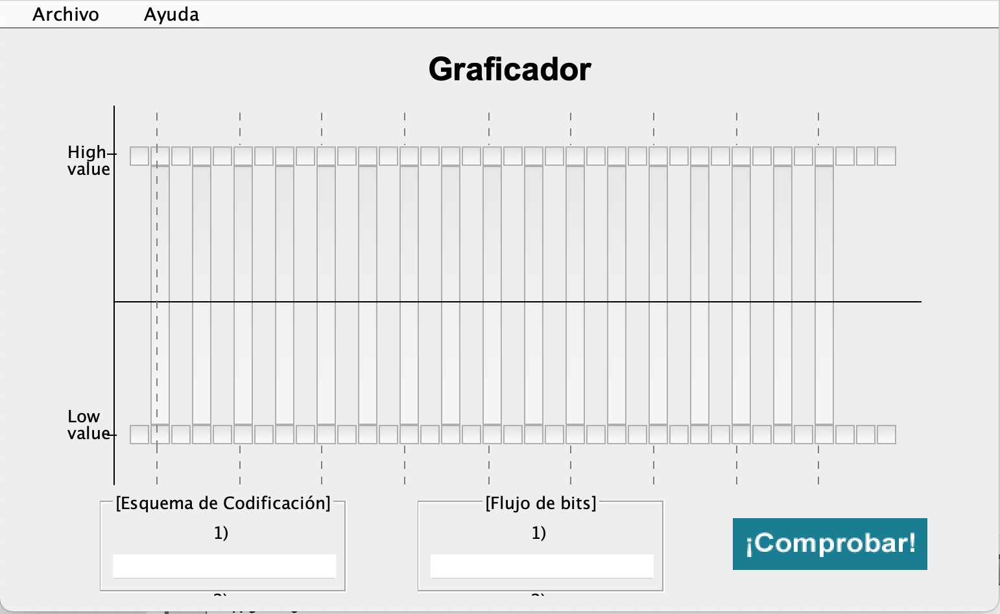
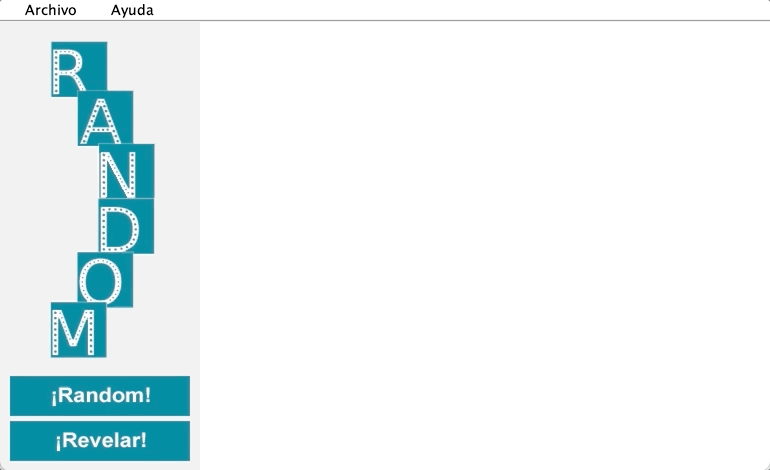
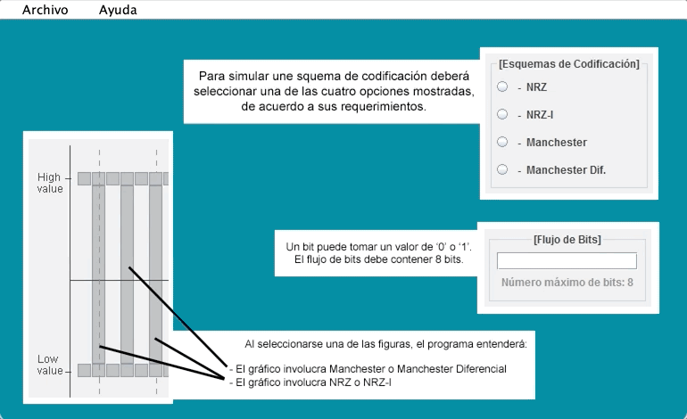

# Esquemas De Codificación

Existen varios sistemas de codificación para señales digitales. Este proyecto simula 4 de estos sistemas: <b>NRZ, NRZ-I, Manchester, y Manchester Diferencial</b>.

## Funcionalidades

#### 1) Nueva Simulación

Permite escoger el tipo de codificación, así como también el flujo de bits que
serán representados. El usuario tiene la opción de escoger el nivel de voltaje
que llega (alto o bajo). El número máximo de bits en el flujo se ha establecido en 8.

 

#### 2) Dibujar gráfico

En esta opción se muestra un panel que contiene botones. De esta manera, el usuario
podrá pasar el mouse sobre botones específicos para dar forma al sistema de codificación
deseado. Los objetivos de esta funcionalidad son identificar el flujo de bits, así como
también el sistema de codificación dibujado.

 

#### 3) Aleatorio

Esta opción permite generar un gráfico, el cual corresponde a un sistema de codificación y a un flujo de bits que se origina de manera aleatoria. La opción genera el gráfico, y mediante un botón, revela el flujo de bits simulado.

 

#### Soporte

